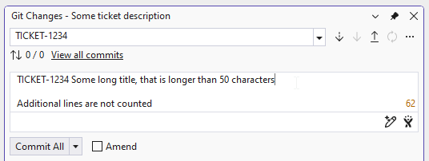
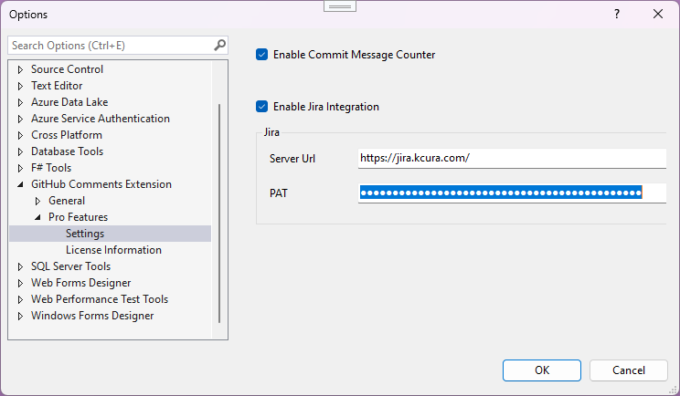

# Karpach.GitHub.Comments

## Overview
GitHub Comments is Visual Studio extension with the following features:

## Features
- Enables spell checking in commit messages
- Enables adding prefix based on the git branch name

## Pro Features

### Commit message character counter

- Adds a live character counter to the Git commit message input in Visual Studio.
- The counter automatically updates as you type commit message.
- Shows the count for the **first line only** (subject line).
- Applies threshold colors:
  - Greater or equal 50 characters warning (orange-like)
  - Greate than 72 characters error (red-like)
  
  

  

The source code is stored in the private repository, but issues can be reported in this GitHub repository.

## Installation
The extension can be installed from the [Visual Studio Marketplace](https://marketplace.visualstudio.com/items?itemName=ViktarKarpach.KarpachGitHubComments).