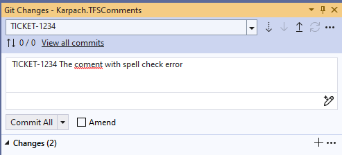
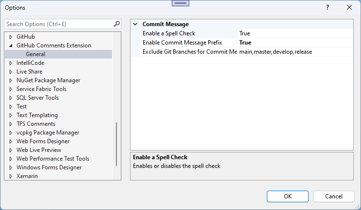

# Karpach.GitHub.Comments

## Overview
GitHub Comments is Visual Studio extension with the following features:

## Features
- Enables spell checking in commit messages
- Enables adding prefix based on the git branch name

The source code is stored in the private repository, but issues can be reported in this GitHub repository.

## Installation
The extension can be installed from the [Visual Studio Marketplace](https://marketplace.visualstudio.com/items?itemName=ViktarKarpach.KarpachGitHubComments).